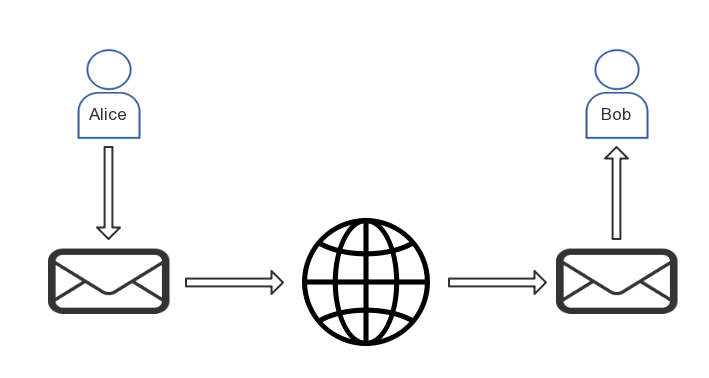
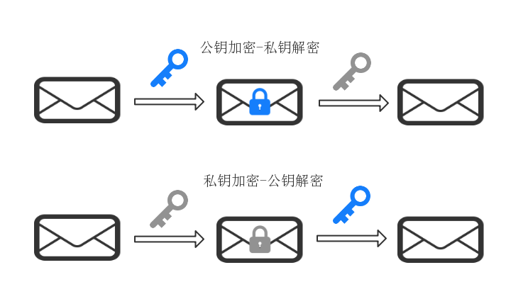
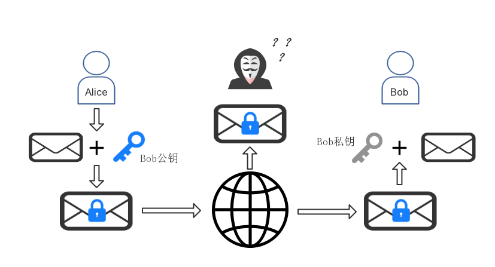

# 非对称加密概述

## 前言

在阅读《精通比特币》的过程中，我发现比特币系统中有两个重要的概念需要利用非对称加密技术：

*比特币地址的生成*

*交易合法性的验证*

因此，我用了几天时间学习了密码学基础知识，尤其是非对称加密技术的原理。这里加以整理总结，本文只求通俗，必需涉及数学公式才能解释的部分只给出优质教程的链接，根据需求选择学习就好。

本文以一个一脸懵逼的新手视角进行介绍：

- 想了解非对称加密，那么对称加密是什么?
- 非对称加密又是什么？？
- 非对称加密技术能做什么？？？
- 如果想深入了解非对称加密算法原理看哪些资料？？？？

## 先说说对称加密

想了解非对称加密，不妨先解释对称加密是什么

对称加密，全称应该是`对称密钥加密`（Symmetric-key algorithm），是密码学中的一类基本的加密算法。这类算法在加密和解密时使用相同的密钥，或是使用两个可以简单地相互推算的密钥。

而在密码学中，`密钥`（key）是指某个用来完成加密、解密、完整性验证等密码学应用的秘密信息。

一个密钥大概长这样“A56FDJK3+dj2slh345dhi”，一般以一定长度的字母和数字组成的字符串来表达，具体长度和使用的字母由具体的加密算法规定，没有统一规定。

下面用例子和图来直观解释对称密钥加密，有请出密码学中出镜率最高的两个人：Alice和Bob

假设Alice正在利用网络向Bob发送一条消息“Alice已向Bob转账1BTC，请查收。”

由于通信过程不能保证是安全的，两人的通信暴露在网络中是存在被第三方劫持的可能

因此Alice和Bob商量使用对称加密方法对消息进行。

为了安全，两人私下确定了使用的加密规则（例如对称加密算法DES）,以及密钥（例如“AliceBobKey”）

于是新的通信过程如下图所示：

从图中可以看出，Alice使用事先商量好的加密算法和密钥对消息进行加密，通过互联网发送给Bob，Bob收到密文后，使用同样的算法和密钥对密文进行解密。加密-解密的过程完全对称，因此被称为对称密钥加密。

于是，即使现在存在第三方劫持了Alice发送的消息，也无法得知消息的具体内容，安全性得到的一定程度的保证。

事实上，这组密钥成为了Alice和Bob的共同秘密，以便维持专属的通信联系，任何一方都不能将密钥泄露。

对称加密的过程非常好理解，在很多场合都需要这种技术，也有着很多优点（比如速度快）。

但与非对称加密相比，要求双方获取相同的密钥是对称密钥加密的主要缺点之一。在某些特殊的场景下，这种加密技术就会有局限性，比如它无法用于身份验证，因为你不能将密钥提供给其他人。

下面就来说说非对称加密

## 非对称加密是什么？

非对称加密（asymmetric cryptography），也称为公开密钥加密（Public-key cryptography），是密码学的一种算法，它需要两个密钥，一个是公开密钥，另一个是私有密钥。顾名思义，公钥可以任意对外发布；而私钥必须由用户自行严格秘密保管，绝不透过任何途径向任何人提供，也不会透露给要通信的另一方，即使他被信任。

**非对称加密的重要性质：**

**1.加密的双向性。**

加密具有双向性，即公钥和私钥中的任一个均可用作加密，此时另一个则用作解密。

使用其中一个密钥把明文加密后所得的密文，只能用相对应的另一个密钥才能解密得到原本的明文，甚至连最初用来加密的密钥也不能用作解密，这是非对称加密最重要的性质或者说特点。

**2.公钥无法推导出私钥**

必须确保使用公钥无法推导出私钥，至少妄想使用公钥推导私钥必须在计算上是不可行的，否则安全性将不复存在。

虽然两个密钥在数学上相关，但如果知道了公钥，并不能凭此计算出私钥；因此公钥可以公开，任意向外发布；而私钥不公开，绝不透过任何途径向任何人提供。

**注1**：任何一种实现上面两条性质的不同方法，便是一种新的非对称加密算法。例如RSA算法和椭圆曲线算法，其背后原理大不相同，但都满足这两个重要性质或者说定义。这就好像好比欧式距离，马氏距离都满足了范数的定义，因此都是一种具体的范数。

**注2**:如果你第一次接触非对称加密，你可能会和我一样对上面两条性质如何实现深感好奇，但目前你不必深陷于此，其背后的数学原理还是需要耐心钻研上几天的。现在仅仅牢记这两个性质就好，文末提供了一些优质的材料以供进一步学习。

## 非对称加密的应用

了解了非对称加密大致是什么，这小节来说说它能够做什么？

前面已经知道，非对称加密具有双向性，即公钥和私钥中的任一个均可用作加密，此时另一个则用作解密。于是不同加密方向便产生了不同的应用。

### 应用1：加密通信

|明文|->公钥加密->|密文|->私钥解密->|明文|

这种加密路径用于和他人进行加密通信，作用等同于对称加密。

我们回到Alice和Bob的例子来看下。

如果Bob想利用非对称加密算法私密的接收他人向他发送的信息，步骤是这样的。

1.首先Bob需要使用具体约定的算法（例如RSA）生成密钥和公钥，密钥自己保留，公钥对外公布。

2.Alice拿到Bob的公钥后，便可以对想要发送的消息“Alice已向Bob转账1BTC，请查收。”进行加密。

3.然后Alice将密文（例如是“FH39ggJ+shi3djifg35”）发送给Bob。

4.Bob收到消息后，用自己的私钥进行解密，还原出消息原文“Alice已向Bob转账1BTC，请查收。”

用图来表示便是下面的过程：

由于使用Bob公钥加密的消息只能用Bob的私钥解密（Bob的公钥也是不行的），而私钥只有Bob拥有，因此即使消息被第三方劫持，他也无法还原出消息明文。

### 应用2：数字签名

如果反过来，先用私钥加密呢？这便诞生了非对称加密的另一个重要应用：数字签名

我们回到Alice和Bob的例子来看下。

在比特币系统中，类似“Alice已向Bob转账1BTC，请查收。”这样的消息最终会被矿工记录在账本上，是与转账双方利益相关的。这样一条消息的受益方是Bob，我们腹黑一点想，如果Bob一直向网络中广播Alice给他转账的消息呢？

Bob：“Alice已向Bob转账1BTC”

Bob：“Alice已向Bob转账2BTC”

Bob：“Alice已向Bob转账3BTC”

...

因此，我们需要一种机制来证明Alice是“自愿”的，也就是消息是Alice亲自发出的。步骤是这样的：

1.Alice需要使用具体约定的算法（例如RSA）生成密钥和公钥，密钥自己保留，公钥对外公布。

2.当Alice想要发送消息 **Alice已向Bob转账1BTC，请查收。| 我的公钥是：“gh3giPGFN2jgh3sF”。** 时，Alice使用自己的私钥对消息进行加密，假设加密后的密文是 **SHG356g3T4+dh4fh**，现在这个密文可以看作Alice的数字签名。

3.Alice将消息明文和数字签名放到一起并发送到网络中

发送的消息类似这样的形式 **Alice已向Bob转账1BTC，请查收。| 我的公钥是：“gh3giPGFN2jgh3sF”。| 签名：“SHG356g3T4+dh4fh”**

4.网络中的所有人接收到消息后，都可以进行如下操作完成验证：

收到消息 **Alice已向Bob转账1BTC，请查收。| 我的公钥是：“gh3giPGFN2jgh3sF”。| 签名：“SHG356g3T4+dh4fh”**

使用Alice在消息中提供的公钥 **gh3giPGFN2jgh3sF**对消息的明文进行解密

将解密结果与数字签名 **SHG356g3T4+dh4fh**进行对比

如果一致，说明消息是Alice亲自发送的，因为只有Alice本人拥有Alice的密钥

如果不一致，则说明消息不是Alice发送的，或者虽然消息是Alice发送的但已遭到他人篡改

5.于是，通过4中描述的方法，Bob确认了Alice给他了一笔价值1BTC的转账。

网络中其他人（矿工）均成功验证了这条消息的真实性，并为Bob作证他的账户新增了1个BTC，Alice的账户减少了1个BTC。

整个过程可以被下图描述：

注1：上面仅仅是对数字签名技术的一个简单描述，很好理解吧~实际应用中的操作略有区别，比如通常是先对明文进行hash，再对hash后结果用私钥进行签名。

注2：此外，上述介绍的数字签名简略版本是存在被第三方攻击的漏洞的。你能想到问题以及如何解决吗？[提示：相同内容的消息、时间戳]

注3：如果你觉得对数字签名的理解还不够清晰，不妨再读读[What is a Digital Signature?](http://www.youdzone.com/signature.html)

### 应用3：数字证书

数字证书是非对称加密的又一个重要应用，由于与区块链的学习的关系相对不那么密切，这里就先放一边了。

大家有兴趣可以看这篇文章[数字证书原理](http://www.blogjava.net/freeman1984/archive/2012/07/24/383817.html),讲的很清晰

## 教程推荐：加密-解密背后的数学原理

读到现在，你应该对非对称加密的步骤非常了解了

但你不清晰的地方是背后的数学原理，其实还是围绕非对称加密的两条性质来的：

- 加密-解密的过程到底是如何实现的？
- 为什么公钥无法推导出私钥？

如果你想进一步探索，不妨读读下面这些资料：

### RSA算法是如何实现加密解密的？

[wiki：RSA algorithm](https://simple.wikipedia.org/wiki/RSA_algorithm)

[阮一峰的网络日志：RSA算法原理（一）](http://www.ruanyifeng.com/blog/2013/06/rsa_algorithm_part_one.html)

[阮一峰的网络日志：RSA算法原理（二）](http://www.ruanyifeng.com/blog/2013/07/rsa_algorithm_part_two.html)

### 椭圆曲线算法的具体原理？

椭圆曲线算法可以用来进行秘密的共享以及数字签名，实际上其具体步骤和本文介绍的还是略有差异的，如果想详细了解原理，不妨看看下面这些文章：

[椭圆曲线算法的几个简单有意思的解释（知乎）](https://www.zhihu.com/question/22399196)

[推荐！椭圆曲线算法的通俗介绍（tutorial）](http://andrea.corbellini.name/2015/05/17/elliptic-curve-cryptography-a-gentle-introduction/)

[椭圆曲线加密算法介绍](https://juejin.im/post/5a67f3836fb9a01c9b661bd3)
