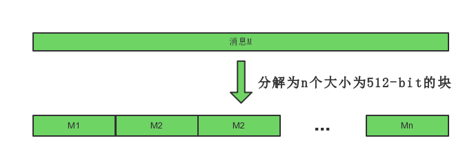
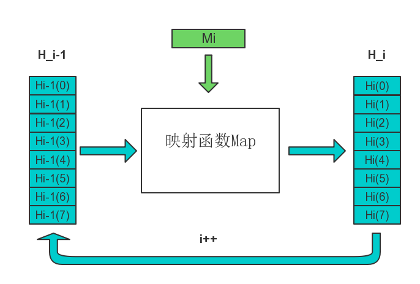
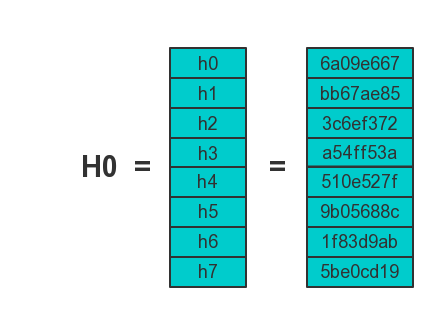
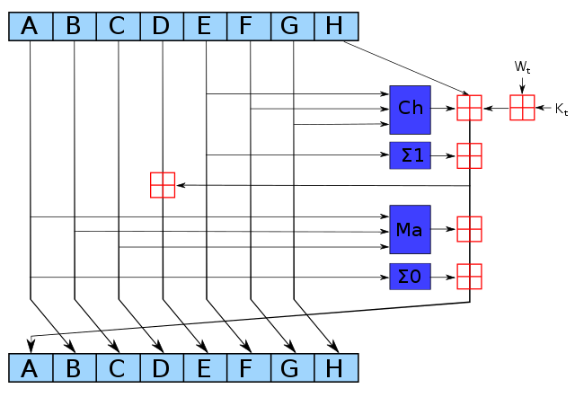

# SHA256算法原理详解

## 1. SHA256简介

SHA256是SHA-2下细分出的一种算法

SHA-2，名称来自于安全散列算法2（英语：Secure Hash Algorithm 2）的缩写，一种密码散列函数算法标准，由美国国家安全局研发，属于SHA算法之一，是SHA-1的后继者。

SHA-2下又可再分为六个不同的算法标准

包括了：SHA-224、SHA-256、SHA-384、SHA-512、SHA-512/224、SHA-512/256。

 这些变体除了生成摘要的长度 、循环运行的次数等一些微小差异外，算法的基本结构是一致的。

回到SHA256上，说白了，它就是一个哈希函数。

哈希函数，又称散列算法，是一种从任何一种数据中创建小的数字“指纹”的方法。散列函数把消息或数据压缩成摘要，使得数据量变小，将数据的格式固定下来。该函数将数据打乱混合，重新创建一个叫做散列值（或哈希值）的指纹。散列值通常用一个短的随机字母和数字组成的字符串来代表。

对于任意长度的消息，SHA256都会产生一个256bit长的哈希值，称作消息摘要。

这个摘要相当于是个长度为32个字节的数组，通常用一个长度为64的十六进制字符串来表示

来看一个例子：

`干他100天成为区块链程序员，红军大叔带领着我们，fighting!`

经过哈希函数SHA256后得到的哈希值为：

`A7FCFC6B5269BDCCE571798D618EA219A68B96CB87A0E21080C2E758D23E4CE9`

这里找到了一个
[SHA256在线验证工具](https://hash.online-convert.com/sha256-generator)
，可以用来进行SHA256哈希结果的验证，后面也可以用来检验自己的SHA256代码是否正确。用起来很方便，不妨感受下。

-------------------

## 2. SHA256原理详解

为了更好的理解SHA256的原理，这里首先将算法中可以单独抽出的模块，包括`常量的初始化`、`信息预处理`、`使用到的逻辑运算`分别进行介绍，甩开这些理解上的障碍后，一起来探索SHA256算法的主体部分，即消息摘要是如何计算的。

### 2.1 常量初始化

SHA256算法中用到了8个哈希初值以及64个哈希常量

其中，SHA256算法的**8个哈希初值**如下：
```
h0 := 0x6a09e667
h1 := 0xbb67ae85
h2 := 0x3c6ef372
h3 := 0xa54ff53a
h4 := 0x510e527f
h5 := 0x9b05688c
h6 := 0x1f83d9ab
h7 := 0x5be0cd19
```
这些初值是对自然数中前8个质数（2,3,5,7,11,13,17,19）的平方根的小数部分取前32bit而来

举个例子来说，<a href="https://www.codecogs.com/eqnedit.php?latex=\sqrt{2}" target="_blank"></a>小数部分约为0.414213562373095048，而

<a href="https://www.codecogs.com/eqnedit.php?latex=$$&space;0.414213562373095048&space;\approx&space;6*16^{-1}&space;&plus;&space;a*16^{-2}&space;&plus;&space;0*16^{-3}&space;&plus;&space;...&space;$$" target="_blank"></a>

于是，质数2的平方根的小数部分取前32bit就对应出了`0x6a09e667`

在SHA256算法中，用到的**64个常量**如下：
```
428a2f98 71374491 b5c0fbcf e9b5dba5
3956c25b 59f111f1 923f82a4 ab1c5ed5
d807aa98 12835b01 243185be 550c7dc3
72be5d74 80deb1fe 9bdc06a7 c19bf174
e49b69c1 efbe4786 0fc19dc6 240ca1cc
2de92c6f 4a7484aa 5cb0a9dc 76f988da
983e5152 a831c66d b00327c8 bf597fc7
c6e00bf3 d5a79147 06ca6351 14292967
27b70a85 2e1b2138 4d2c6dfc 53380d13
650a7354 766a0abb 81c2c92e 92722c85
a2bfe8a1 a81a664b c24b8b70 c76c51a3
d192e819 d6990624 f40e3585 106aa070
19a4c116 1e376c08 2748774c 34b0bcb5
391c0cb3 4ed8aa4a 5b9cca4f 682e6ff3
748f82ee 78a5636f 84c87814 8cc70208
90befffa a4506ceb bef9a3f7 c67178f2
```
和8个哈希初值类似，这些常量是对自然数中前64个质数(2,3,5,7,11,13,17,19,23,29,31,37,41,43,47,53,59,61,67,71,73,79,83,89,97...)的立方根的小数部分取前32bit而来。


### 2.2 信息预处理(pre-processing)

SHA256算法中的预处理就是在想要Hash的消息后面补充需要的信息，使整个消息满足指定的结构。

信息的预处理分为两个步骤：`附加填充比特`和`附加长度`

**STEP1：附加填充比特**

在报文末尾进行填充，使报文长度在对512取模以后的余数是448

填充是这样进行的：先补第一个比特为1，然后都补0，直到长度满足对512取模后余数是448。

需要注意的是，信息必须进行填充，也就是说，即使长度已经满足对512取模后余数是448，补位也必须要进行，这时要填充512个比特。

因此，填充是至少补一位，最多补512位。

**例**：以信息“abc”为例显示补位的过程。

a,b,c对应的[ASCII码](http://ascii.911cha.com/)分别是97,98,99

于是原始信息的二进制编码为：01100001 01100010 01100011

补位第一步，首先补一个“1” ：  0110000101100010 01100011 1

补位第二步,补423个“0”：01100001 01100010 01100011 10000000 00000000 ... 00000000

补位完成后的数据如下（为了简介用16进制表示）：
```
61626380 00000000 00000000 00000000
00000000 00000000 00000000 00000000
00000000 00000000 00000000 00000000
00000000 00000000
```

为什么是448?

因为在第一步的预处理后，第二步会再附加上一个64bit的数据，用来表示原始报文的长度信息。而448+64=512，正好拼成了一个完整的结构。


**STEP2：附加长度值**

附加长度值就是将原始数据（第一步填充前的消息）的长度信息补到已经进行了填充操作的消息后面。

wiki百科中给出的原文是：*append length of message (before pre-processing), in bits, as 64-bit big-endian integer*

SHA256用一个64位的数据来表示原始消息的长度。

因此，通过SHA256计算的消息长度必须要小于<a href="https://www.codecogs.com/eqnedit.php?latex=2^64" target="_blank"></a>，当然绝大多数情况这足够大了。

长度信息的编码方式为64-bit big-endian integer

关于[Big endian](#Big_endian)
<span id="Big_endian_return"></span>
的含义，文末给出了补充

回到刚刚的例子，消息“abc”，3个字符，占用24个bit

因此，在进行了补长度的操作以后，整个消息就变成下面这样了（16进制格式）
```
61626380 00000000 00000000 00000000
00000000 00000000 00000000 00000000
00000000 00000000 00000000 00000000
00000000 00000000 00000000 00000018
```

### 2.3 逻辑运算
SHA256散列函数中涉及的操作全部是逻辑的位运算

包括如下的逻辑函数：

<a href="https://www.codecogs.com/eqnedit.php?latex=\begin{align*}&space;Ch(x,y,z)&space;&=&space;(x&space;\land&space;y)&space;\oplus&space;(\neg&space;x&space;\land&space;z)&space;\\&space;Ma(x,y,z)&space;&=&space;(x&space;\land&space;y)&space;\oplus&space;(x&space;\land&space;z)&space;\oplus&space;(y&space;\land&space;z)&space;\\&space;\Sigma_{0}(x)&space;&=&space;S^{2}(x)&space;\oplus&space;S^{13}(x)&space;\oplus&space;S^{22}(x)&space;\\&space;\Sigma_{1}(x)&space;&=&space;S^{6}(x)&space;\oplus&space;S^{11}(x)&space;\oplus&space;S^{25}(x)&space;\\&space;\sigma_{0}(x)&space;&=&space;S^{7}(x)&space;\oplus&space;S^{18}(x)&space;\oplus&space;R^{3}(x)&space;\\&space;\sigma_{1}(x)&space;&=&space;S^{17}(x)&space;\oplus&space;S^{19}(x)&space;\oplus&space;R^{10}(x)&space;\end{align*}" target="_blank"></a>

其中：
| 逻辑运算   | 含义           |
| ---------- | -------------- |
| <a href="https://www.codecogs.com/eqnedit.php?latex=\land" target="_blank"></a> | 按位“与”       |
| <a href="https://www.codecogs.com/eqnedit.php?latex=\neg" target="_blank"></a>  | 按位“补”       |
| <a href="https://www.codecogs.com/eqnedit.php?latex=\oplus" target="_blank"></a> | 按位“异或”     |
| <a href="https://www.codecogs.com/eqnedit.php?latex=S^{n}" target="_blank"></a> | 右移n个bit     |
| <a href="https://www.codecogs.com/eqnedit.php?latex=R^{n}" target="_blank"></a> | 循环右移n个bit |

### 2.4 计算消息摘要

现在来介绍SHA256算法的主体部分，即消息摘要是如何计算的。

**首先：将消息分解成512-bit大小的块**

break message into 512-bit chunks



假设消息M可以被分解为n个块，于是整个算法就是完成n次迭代，n次迭代的结果就是最终的哈希值，即256bit的数字摘要。

一个256-bit的摘要初始值H0，经过第一个数据块得到H1，即完成了第一次迭代

H1经过第二个数据块得到H2，……，依次处理，最后得到Hn，Hn即为最终的256-bit消息摘要

将每次迭代进行的映射用<a href="https://www.codecogs.com/eqnedit.php?latex=Map(H_{i-1})&space;=&space;H_{i}" target="_blank"></a>表示，于是迭代可以更形象的展示为：



图中256-bit的`Hi`被描述8个小块，这是因为SHA256算法中的最小运算单元称为“字”（Word），一个字是32位。

进而，第一次迭代中，映射的初值设置为前面介绍的8个哈希初值，如下图所示：



下面开始介绍每一次迭代的内容，即映射<a href="https://www.codecogs.com/eqnedit.php?latex=Map(H_{i-1})&space;=&space;H_{i}" target="_blank"></a>的具体算法

**STEP1：构造64个字（word）**

break chunk into sixteen 32-bit big-endian words w[0], ..., w[15]

对于每一块，将块分解为16个32-bit的big-endian的字，记为w[0], ..., w[15]

也就是说，前16个字直接有消息的第i个块分解得到

其余的字由迭代公式得到：

<a href="https://www.codecogs.com/eqnedit.php?latex=$$&space;W_{t}&space;=&space;\sigma_{1}(W_{t-2})&space;&plus;&space;W_{t-7}&space;&plus;&space;\sigma_{0}(W_{t-15})&space;&plus;&space;W_{t-16}$$" target="_blank"></a>

**STEP2：进行64次循环**

现在，进行64次加密循环即可完成一次迭代

每次加密循环可以由下图描述：



图中，ABCDEFGH这8个字（word）在按照如图的规则进行更新，其中

深蓝色方块是事先定义好的非线性逻辑函数，上文已经做过铺垫

红色田字方块代表 mod <a href="https://www.codecogs.com/eqnedit.php?latex=2^{32}" target="_blank"></a> addition，即将两个数字加在一起，如果结果大于<a href="https://www.codecogs.com/eqnedit.php?latex=2^{32}" target="_blank"></a>，你必须除以<a href="https://www.codecogs.com/eqnedit.php?latex=2^{32}" target="_blank"></a>并找到余数。

ABCDEFGH一开始的初始值分别为<a href="https://www.codecogs.com/eqnedit.php?latex=H_{i}(0),H_{i}(1),...,H_{i}(7)" target="_blank"></a>

Kt是第t个密钥，对应我们上文提到的64个常量

Wt是本区块产生第t个word。原消息被切成固定长度512-bit的区块，对每一个区块，产生64个word，通过重复运行循环n次对ABCDEFGH这八个字循环加密。

最后一次循环所产生的八个字合起来即是第i个块对应到的散列字符串<a href="https://www.codecogs.com/eqnedit.php?latex=H_{i}" target="_blank"></a>

由此变完成了SHA256算法的所有介绍

-------------------

## 3. SHA256算法伪代码

现在我们可以结合SHA256算法的伪代码,将上述的所有步骤进行梳理整合：

```
Note: All variables are unsigned 32 bits and wrap modulo 232 when calculating


Initialize variables
(first 32 bits of the fractional parts of the square roots of the first 8 primes 2..19):
h0 := 0x6a09e667
h1 := 0xbb67ae85
h2 := 0x3c6ef372
h3 := 0xa54ff53a
h4 := 0x510e527f
h5 := 0x9b05688c
h6 := 0x1f83d9ab
h7 := 0x5be0cd19


Initialize table of round constants
(first 32 bits of the fractional parts of the cube roots of the first 64 primes 2..311):
k[0..63] :=
   0x428a2f98, 0x71374491, 0xb5c0fbcf, 0xe9b5dba5, 0x3956c25b, 0x59f111f1, 0x923f82a4, 0xab1c5ed5,
   0xd807aa98, 0x12835b01, 0x243185be, 0x550c7dc3, 0x72be5d74, 0x80deb1fe, 0x9bdc06a7, 0xc19bf174,
   0xe49b69c1, 0xefbe4786, 0x0fc19dc6, 0x240ca1cc, 0x2de92c6f, 0x4a7484aa, 0x5cb0a9dc, 0x76f988da,
   0x983e5152, 0xa831c66d, 0xb00327c8, 0xbf597fc7, 0xc6e00bf3, 0xd5a79147, 0x06ca6351, 0x14292967,
   0x27b70a85, 0x2e1b2138, 0x4d2c6dfc, 0x53380d13, 0x650a7354, 0x766a0abb, 0x81c2c92e, 0x92722c85,
   0xa2bfe8a1, 0xa81a664b, 0xc24b8b70, 0xc76c51a3, 0xd192e819, 0xd6990624, 0xf40e3585, 0x106aa070,
   0x19a4c116, 0x1e376c08, 0x2748774c, 0x34b0bcb5, 0x391c0cb3, 0x4ed8aa4a, 0x5b9cca4f, 0x682e6ff3,
   0x748f82ee, 0x78a5636f, 0x84c87814, 0x8cc70208, 0x90befffa, 0xa4506ceb, 0xbef9a3f7, 0xc67178f2


Pre-processing:
append the bit '1' to the message
append k bits '0', where k is the minimum number >= 0 such that the resulting message
    length (in bits) is congruent to 448(mod 512)
append length of message (before pre-processing), in bits, as 64-bit big-endian integer


Process the message in successive 512-bit chunks:
break message into 512-bit chunks
for each chunk
    break chunk into sixteen 32-bit big-endian words w[0..15]

    Extend the sixteen 32-bit words into sixty-four 32-bit words:
    for i from 16 to 63
        s0 := (w[i-15] rightrotate 7) xor (w[i-15] rightrotate 18) xor(w[i-15] rightshift 3)
        s1 := (w[i-2] rightrotate 17) xor (w[i-2] rightrotate 19) xor(w[i-2] rightshift 10)
        w[i] := w[i-16] + s0 + w[i-7] + s1

    Initialize hash value for this chunk:
    a := h0
    b := h1
    c := h2
    d := h3
    e := h4
    f := h5
    g := h6
    h := h7

    Main loop:
    for i from 0 to 63
        s0 := (a rightrotate 2) xor (a rightrotate 13) xor(a rightrotate 22)
        maj := (a and b) xor (a and c) xor(b and c)
        t2 := s0 + maj
        s1 := (e rightrotate 6) xor (e rightrotate 11) xor(e rightrotate 25)
        ch := (e and f) xor ((not e) and g)
        t1 := h + s1 + ch + k[i] + w[i]
        h := g
        g := f
        f := e
        e := d + t1
        d := c
        c := b
        b := a
        a := t1 + t2

    Add this chunk's hash to result so far:
    h0 := h0 + a
    h1 := h1 + b
    h2 := h2 + c
    h3 := h3 + d
    h4 := h4 + e
    h5 := h5 + f
    h6 := h6 + g
    h7 := h7 + h

Produce the final hash value (big-endian):
digest = hash = h0 append h1 append h2 append h3 append h4 append h5 append h6 append h7
```
-------------------
## 4. 参考文献

本篇笔记主要参考整合的资料如下：

[SHA-2 wiki](https://zh.wikipedia.org/wiki/SHA-2)

[比特币算法——SHA256算法介绍](https://blog.csdn.net/wowotuo/article/details/78907380)

[SHA-256算法实现](https://blog.csdn.net/lwanttowin/article/details/53726450)

[操作指南：验证SHA256](https://nxtwiki.org/mediawiki/index.php?title=How-To:VerifySHA256/zh&variant=zh)

-------------------
-------------------
# 知识填补

## 大端和小端（Big endian and Little endian）
<span id="Big_endian"></span>

对于整型、长整型等数据类型，都存在字节排列的高低位顺序问题。

Big endian 认为第一个字节是最高位字节（按照从低地址到高地址的顺序存放数据的高位字节到低位字节）

而 Little endian 则相反，它认为第一个字节是最低位字节（按照从低地址到高地址的顺序存放据的低位字节到高位字节）。

例如，假设从内存地址 0x0000 开始有以下数据：
| 地址   | 数据 |
| ------ | ---- |
| ...    | ...  |
| 0x0000 | 0x12 |
| 0x0001 | 0x34 |
| 0x0002 | 0xab |
| 0x0003 | 0xcd |
| ...    | ...  |

假设我们去读取一个地址为 0x0000 的四个字节变量

若字节序为big-endian，则读出结果为0x1234abcd；

若字节序为little-endian，则读出结果为0xcdab3412。

如果我们将0x1234abcd 写入到以 0x0000 开始的内存中，则Little endian 和 Big endian 模式的存放结果如下：
| 地址           | 0x0000 | 0x0001 | 0x0002 | 0x0003 |
| -------------- | ------ | ------ | ------ | ------ |
| big-Big_endian | 0x12   | 0x34   | 0xab   | 0xcd   |
| little-endian  | 0xcd   | 0xab   | 0x34   | 0x12   |

[参考文献](#https://www.cnblogs.com/luxiaoxun/archive/2012/09/05/2671697.html)

[点击返回](#Big_endian_return)
